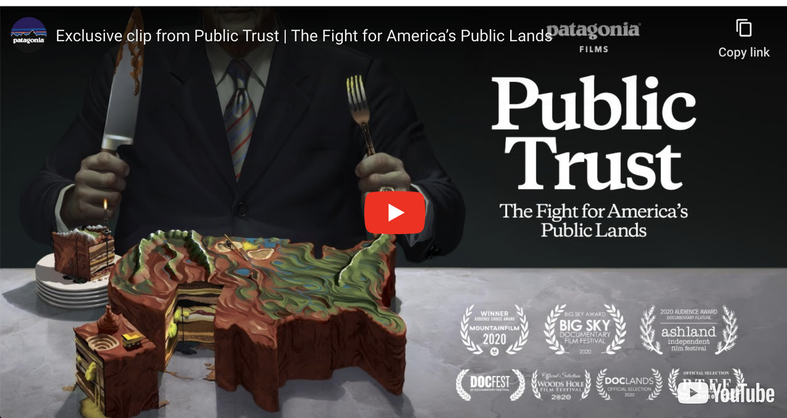

# 
</img>

 

Landwatch is a project exploring the network of federal public lands, legislation, legislators, and campaign finance donations in the United States. The intention is to reveal the myriad factors influencing American public lands policy and decisionmaking.

## About

The aim of this project is twofold: to __generate a database__ of the connections between American federal public lands, legislation, legislators, and campaign finance donations, and to __publish a visualiation__ of these data to allow individuals to explore the myriad forces impacting their favorite pieces of public land.

We hope that this project will be useful for many types of people, including environmental NGOs, activists, and individual citizens.

This project was inspired by the film _Public Trust_, to be released 25 September, 2020. A summary:

> In a time of growing polarization, Americans still share something in common: 640 million acres of public land. Held in trust by the federal government for all citizens of the United States, these places are a stronghold against climate change, sacred to native people, home to wildlife and intrinsic to our national identity. But today, despite support from voters across the political spectrum, they face unprecedented threats from extractive industries and the politicians in their pockets. Part love letter, part political exposé, Public Trust investigates how we arrived at this precarious moment through three heated conflicts—a national monument in the Utah desert, a proposed mine in the Boundary Waters and oil drilling in the Arctic National Wildlife Refuge—and makes a case for their continued protection.

 Watch the trailer:

## Contributing

### Research
There are quite a bit of research questions in this project that either pertain to the resources that are best used in our implementation (e.g. what data sources are best?), or to the possible investigations that could be done with our database.

### Implementation
This project is developed using Python, Postgres, and Javascript. If you have skills in these or other tools, or want to learn, we'd love for you to help. The best way to start is to check out the open issues page and pick one that sounds interesting.

The first major project is the database creation, which we've divided up into several Python modules. Check out [`landwatch/get/README.md`](landwatch/get) for documentation of the constituent modules there.
