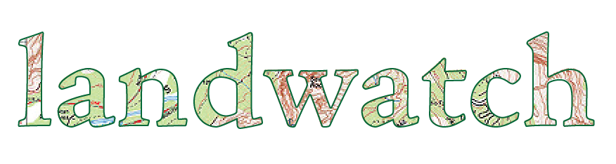

# </img>

Landwatch is a Python package under development to organize and visualize the connections between United States federal public lands, legislation, legislators, and corporate campaign financiers.

It consists of a command-line application which facilitates the acquisition, organization, and visualization of the data in the project.

## Components

Landwatch is a set of modules tied together with a [CLI](#The-CLI). Each sub-module within `landwatch` contains supporting code for a single high-level component of the project. Each of these sub-modules exposes a command-line interface (via `@click.command`) which is exported via the `_cli` attribute of each modules' `__init__.py`. The sub-modules are as follows:

* `get`: data acquisition

### The CLI Implementation

I made a few structural choices in implementing the CLI which are worth noting.

The CLI is implemented in `cli.py` at top-level. This file defines a [Click](https://click.palletsprojects.com/en/7.x/) command line argument parser, which scans the package directory for submodules and adds any exposed command-line parsers (via the `_cli` attribute in each) to the main parser. Running `python -m landwatch` from the repository root invokes `__main__.py`, which imports the command line argument parser from `cli.py` and begins the argument parsing flow.
